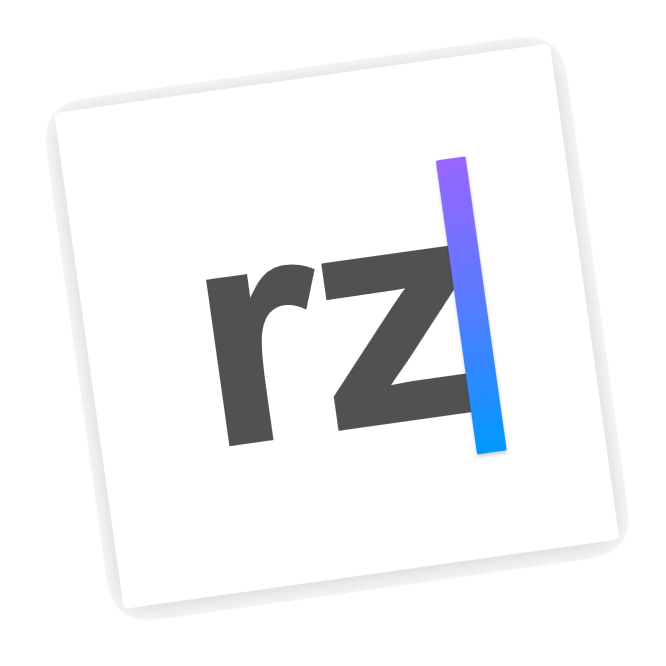

[](https://github.com/facebook/react/blob/master/LICENSE) [](CONTRIBUTING.md#pull-requests)

<div align="center">
  <a href="https://github.com/Caldis/react-zmage">
    
  </a>
  <h1>react-zmage</h1>
</div>

> react-zmage 是一个基于 React 的的图片缩放控件, 使用 Zmage 标签包裹后的图片可以获得缩放效果, 您可以用这个控件替代原生的 img 标签, 令其附带图片缩放功能

**需 react 版本大于 v16.6.0**
<h2 align="center">演示</h2>

**在线**

[https://zmage.caldis.me](https://zmage.caldis.me)


**本地**
```bash
git clone https://github.com/Caldis/react-zmage
cd react-zmage
npm i
npm run dev
```


<h2 align="center">安装</h2>

```bash
npm i react-zmage --save
```


<h2 align="center">使用</h2>


#### 1.引入组件
```js
import Zmage from 'react-zmage'
```

#### 2.将页面中的 img 标签替换为 Zmage 组件
```js

👆 to 👇
<Zmage src="图片源连接"/>
```
<h6>现在这些图片都可以放大查看了 ！</h6>

#### 也可以通过函数调用来唤出图片
```js
// Zmage.browsing 函数接受的参数与 <Zmage/> 组件完全一致
<a onClick={() => Zmage.browsing({ src:imagePath })}>任意元素</a>
```

#### 在`typescript`中使用

```typescript
import ReactZmage from 'react-zmage';

// 在生命周期等方法中使用
public componentDidMount() {
    const zmage = new ReactZmage({
        // ...options
    });
}

// 也支持组件方式使用
public render(): JSX.Element {
    const defaultConfig = {
        src: 'http://zmage.caldis.me/imgSet/childsDream/demo.jpg',
        alt: '示例图片',
    };

    return (
        <ReactZmage
            {...defaultConfig}
        />
    );
}
```

<h2 align="center">基础配置</h2>
<h6 align="center">立即上手, 你仅仅需要了解下面的几个参数就足够了</h6>

#### 在线示例, 请参见 [https://zmage.caldis.me](https://zmage.caldis.me)

- 基础调用属性

|配置项|类型|默认值|描述|示例|
|:--:|:--:|:-----:|:----------|:----------:|
| **`src`** | String | "" | 图片 Url，与 `img` 标签的 `src` 属性相同 | [示例](https://github.com/Caldis/react-zmage#src) |
| **`alt`** | String | "" | 图片占位文字，与 `img` 标签的 `alt` 属性相同 | [示例](https://github.com/Caldis/react-zmage#alt) |
| **`set`** | Object[] | [] | 序列图片, 可以在 `set` 中传入多个图片对象用于在查看模式下呈现多张图片，也可用于呈现放大后的高清图片 | [示例](https://github.com/Caldis/react-zmage#set) |
| **`defaultPage`** | Number | 0 | 如果传入了`set`来展示多张图片, 可以用于指定打开后的默认页 | [示例](https://github.com/Caldis/react-zmage#defaultPage) |

<h2 align="center">高级配置</h2>
<h6 align="center">不需要了解这些参数也可以很好的使用, 但如果你需要更详细的定制, 可以进一步查阅下面的内容</h2>

- 预设配置 (beta)

|配置项|类型|默认值|描述|示例|
|:--:|:--:|:-----:|:----------|:----------:|
| **`preset`** | String | "auto" | 轻松配置界面的功能及样式, 可设置为 `auto` `desktop` `mobile` | [示例](https://github.com/Caldis/react-zmage#preset) [受影响的配置项](https://github.com/Caldis/react-zmage/blob/master/src/config/default.js#L144) |

- 受控属性

|配置项|类型|默认值|描述|示例|
|:--:|:--:|:-----:|:---------------|:----------:|
| **`browsing`** | Boolean | empty | 控制是否进入查看模式 | [示例](https://github.com/Caldis/react-zmage#browsing) |

- 功能控制

|配置项|类型|默认值|描述|示例|
|:--:|:--:|:-----:|:---------------|:----------:|
| **`controller`** | [查看](https://github.com/Caldis/react-zmage/blob/9e13e09fe77b7944251af8b8d1b453c21d7e0445/src/config/default.js#L60) | [桌面](https://github.com/Caldis/react-zmage/blob/9e13e09fe77b7944251af8b8d1b453c21d7e0445/src/config/default.js#L136)\|[移动](https://github.com/Caldis/react-zmage/blob/9e13e09fe77b7944251af8b8d1b453c21d7e0445/src/config/default.js#L156) | 将特定项设为 `false` 来隐藏查看模式下的操作控件 | [示例](https://github.com/Caldis/react-zmage#controller) |
| **`hotKey`** | [查看](https://github.com/Caldis/react-zmage/blob/9e13e09fe77b7944251af8b8d1b453c21d7e0445/src/config/default.js#L76) | [桌面](https://github.com/Caldis/react-zmage/blob/9e13e09fe77b7944251af8b8d1b453c21d7e0445/src/config/default.js#L144)\|[移动](https://github.com/Caldis/react-zmage/blob/9e13e09fe77b7944251af8b8d1b453c21d7e0445/src/config/default.js#L164) | 将特定项设为 `false` 来禁用查看模式下的快捷键 | [示例](https://github.com/Caldis/react-zmage#hotKey) |
| **`animate`** | [查看](https://github.com/Caldis/react-zmage/blob/9e13e09fe77b7944251af8b8d1b453c21d7e0445/src/config/default.js#L88) | [桌面](https://github.com/Caldis/react-zmage/blob/9e13e09fe77b7944251af8b8d1b453c21d7e0445/src/config/default.js#L149)\|[移动](https://github.com/Caldis/react-zmage/blob/9e13e09fe77b7944251af8b8d1b453c21d7e0445/src/config/default.js#L169) | 传入特定的参数指定翻页动画（browsing 动画暂不可配置） [可选值](https://github.com/Caldis/react-zmage/blob/9e13e09fe77b7944251af8b8d1b453c21d7e0445/src/config/default.js#L62) | [示例](https://github.com/Caldis/react-zmage#animate) |

- 界面样式

|配置项|类型|默认值|描述|示例|
|:--:|:--:|:-----:|:----------|:----------:|
| **`backdrop`** | String | "#FFFFFF" | 控制图片放大后的背景色 | [示例](https://github.com/Caldis/react-zmage#backdrop) |
| **`zIndex`** | Number | 1000 | 控制外部容器的 `z-index`, 防止被其他元素遮挡 | [示例](https://github.com/Caldis/react-zmage#zIndex) |
| **`radius`** | Number | [桌面](https://github.com/Caldis/react-zmage/blob/master/src/config/default.js#L160)\|[移动](https://github.com/Caldis/react-zmage/blob/master/src/config/default.js#L178) | 控制图片在查看模式下的圆角 | [示例](https://github.com/Caldis/react-zmage#radius) |
| **`edge`** | Number | [桌面](https://github.com/Caldis/react-zmage/blob/master/src/config/default.js#L161)\|[移动](https://github.com/Caldis/react-zmage/blob/master/src/config/default.js#L179) | 控制图片在查看模式下距离屏幕边缘的距离 | [示例](https://github.com/Caldis/react-zmage#edge) |

- 生命周期

|配置项|类型|默认值|描述|示例|
|:--:|:--:|:-----:|:----------|:----------:|
| **`onBrowsing`** | func | (browsing)=>{} | 生命周期方法, 在显示/隐藏时调用, 会回传显示状态 | [示例](https://github.com/Caldis/react-zmage#onBrowsing) |
| **`onZooming`** | func | (zooming)=>{} | 生命周期方法, 在放大/缩小时调用, 会回传缩放状态 | [示例](https://github.com/Caldis/react-zmage#onZooming) |
| **`onSwitching`** | func | (paging)=>{} | 生命周期方法, 在切换图片时调用, 会回传页码 | [示例](https://github.com/Caldis/react-zmage#onSwitching) |
| **`onRotating`** | func | (deg)=>{} | 生命周期方法, 在旋转图片时调用, 会回传角度 | [示例](https://github.com/Caldis/react-zmage#onRotating) |

### `src`
```js
"http://zmage.caldis.me/imgSet/childsDream/demo.jpg"
```

### `alt`
```js
"图片的占位文字，作为图片的标题, 请尽量保持简短"
```

### `set`
```js
// 如果设置了 Set, 则进入查看模式后第一张图片将会是 set 的首图, 而不是 src
// 如果你需要在查看模式中呈现高精度图片, 可以将其设置为 set 的首图, 或使用 defaultPage 指定
set={[
    {
        // 图片 Url
        src: "http://zmage.caldis.me/imgSet/childsDream/1.jpg",
        // 图片占位文字
        alt: "图片的占位文字，作为图片的标题, 请尽量保持简短",
        // 图片样式
        style: { borderRadius: 30 },
        // 图片类名
        className: 'testClassName'
    },
    {
        // 另一个图片 Url
        src: "http://zmage.caldis.me/imgSet/childsDream/2.jpg",
        // 另一段图片占位文字
        alt: "图片的占位文字，作为图片的标题, 请尽量保持简短",
    }
]}
```

### `defaultPage`
```js
set: [
    {
        // 图片 Url
        src: "http://zmage.caldis.me/imgSet/childsDream/1.jpg",
        // 图片占位文字
        alt: "图片的占位文字，尽量保持简短，描述图片作用",
    }
]
```

### `browsing`
```js
browsing={this.state.contrlledZmageState}
```

### `controller`
```js
controller={{
    // 关闭按钮
    close: true,
    // 缩放按钮
    zoom: true,
    // 下载按钮
    download: true,
    // 旋转按钮
    rotate: true,
    // 翻页按钮
    flip: true,
    // 多页指示
    pagination: true,
}}
```

### `hotKey`
```js
hotKey={{
    // 关闭（ESC）
    close: true,
    // 缩放（空格）
    zoom: true,
    // 翻页（左右）
    flip: true,
}}
```

### `animate`
```js
animate={{
    flip: 'fade',
}}
```

### `backdrop`
```js
backdrop="linear-gradient(90deg, rgba(0,212,255,1) 0%, rgba(26,94,215,1) 100%)"
```

### `zIndex`
```js
zIndex={19260817}
```

### `radius`
```js
radius={5}
```

### `edge`
```js
edge={20}
```

### `onBrowsing`
```js
onBrowsing={state => {
    console.info("Browsing State: ", state)
}}
```

### `onZooming`
```js
onZooming={state => {
    console.info("Zooming State: ", state)
}}
```

### `onSwitching`
```js
onSwitching={page => {
    console.info("Switching page: ", page)
}}
```

### `onRotating`
```js
onRotating={deg => {
    console.info("Rotating State: ", deg, "deg")
}}
```


<h2 align="center">贡献</h2>

我们随时欢迎发起一个 [PR](https://github.com/Caldis/react-zmage/pulls) 来帮助我们改进代码
如果发现任何问题, 也欢迎 [发起一个ISSUE](https://github.com/Caldis/react-zmage/issues) 来反馈你的意见

<h2 align="center">引用</h2>
- [Material Icons](https://material.io/tools/icons/)

<h2 align="center">证书</h2>

react-zmage 基于 [MIT licensed](./LICENSE) 发布
